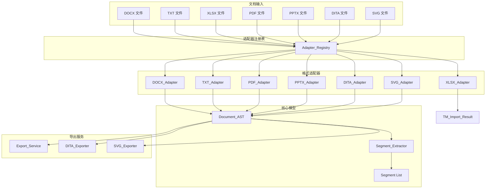

# Design Document: Multi-Format Adapter

## Overview

本设计文档描述翻译系统多格式文档适配器的技术架构。系统采用适配器模式，通过统一接口支持多种文档格式的解析和导出，将不同格式转换为统一的 Document AST 和 Segment 模型。

核心设计原则：
- **统一接口**：所有适配器遵循相同的接口规范
- **可扩展性**：支持运行时注册新适配器
- **稳定性**：Segment ID 跨解析保持一致
- **双向转换**：支持解析和导出的往返操作

## Architecture



## Components and Interfaces

### Format_Adapter 接口

```python
from abc import ABC, abstractmethod
from dataclasses import dataclass
from typing import List

@dataclass
class Parse_Result:
    ast: "Document_AST"
    segments: List["Segment"]
    metadata: dict

class Format_Adapter(ABC):
    @abstractmethod
    def parse(self, raw_bytes: bytes) -> Parse_Result:
        """解析文档字节流，返回 AST 和 Segment 列表"""
        pass

    @abstractmethod
    def supported_extensions(self) -> List[str]:
        """返回支持的文件扩展名列表"""
        pass

    def can_parse(self, filename: str) -> bool:
        """检查文件是否可被此适配器解析"""
        ext = Path(filename).suffix.lower()
        return ext in self.supported_extensions()
```

### Adapter_Registry

```python
class Adapter_Registry:
    def __init__(self):
        self._adapters: dict[str, Format_Adapter] = {}

    def register(self, adapter: Format_Adapter) -> None:
        """注册适配器，验证接口合规性"""
        if not isinstance(adapter, Format_Adapter):
            raise TypeError("Adapter must implement Format_Adapter interface")
        for ext in adapter.supported_extensions():
            self._adapters[ext.lower()] = adapter

    def get_adapter(self, filename: str) -> Format_Adapter:
        """根据文件名获取适配器"""
        ext = Path(filename).suffix.lower()
        if ext not in self._adapters:
            raise UnsupportedFormatError(f"No adapter for extension: {ext}")
        return self._adapters[ext]

    def list_supported_extensions(self) -> List[str]:
        """列出所有支持的扩展名"""
        return list(self._adapters.keys())
```

### Export_Service 接口

```python
class Export_Service:
    def export_docx(self, ast: Document_AST, translations: dict) -> bytes:
        """导出为 DOCX 格式"""
        pass

    def export_txt(self, ast: Document_AST, translations: dict) -> bytes:
        """导出为 TXT 格式"""
        pass

    def export_bilingual(self, ast: Document_AST, translations: dict, format: str) -> bytes:
        """导出双语对照文档"""
        pass

    def export_batch(self, documents: List[tuple], format: str) -> bytes:
        """批量导出为 ZIP 压缩包"""
        pass
```

## Data Models

### Document_AST

```python
from dataclasses import dataclass, field
from enum import Enum
from typing import List, Optional, Any

class NodeType(Enum):
    PARAGRAPH = "paragraph"
    TABLE = "table"
    TABLE_ROW = "table_row"
    TABLE_CELL = "table_cell"
    HEADING = "heading"
    LIST_ITEM = "list_item"
    SLIDE = "slide"
    TEXT = "text"
    NOTE = "note"
    CODEBLOCK = "codeblock"

@dataclass
class Block_Node:
    node_type: NodeType
    children: List["Block_Node"] = field(default_factory=list)
    text_content: Optional[str] = None
    metadata: dict = field(default_factory=dict)

    def to_dict(self) -> dict:
        return {
            "node_type": self.node_type.value,
            "children": [c.to_dict() for c in self.children],
            "text_content": self.text_content,
            "metadata": self.metadata,
        }

    @classmethod
    def from_dict(cls, data: dict) -> "Block_Node":
        return cls(
            node_type=NodeType(data["node_type"]),
            children=[cls.from_dict(c) for c in data.get("children", [])],
            text_content=data.get("text_content"),
            metadata=data.get("metadata", {}),
        )

@dataclass
class Document_AST:
    nodes: List[Block_Node] = field(default_factory=list)
    source_format: str = ""
    metadata: dict = field(default_factory=dict)

    def to_json(self) -> str:
        import json
        return json.dumps({
            "nodes": [n.to_dict() for n in self.nodes],
            "source_format": self.source_format,
            "metadata": self.metadata,
        }, ensure_ascii=False)

    @classmethod
    def from_json(cls, json_str: str) -> "Document_AST":
        import json
        data = json.loads(json_str)
        return cls(
            nodes=[Block_Node.from_dict(n) for n in data["nodes"]],
            source_format=data.get("source_format", ""),
            metadata=data.get("metadata", {}),
        )
```

### Segment

```python
@dataclass
class Segment:
    segment_id: str
    source_text: str
    display_text: str
    block_path: str  # e.g., "0.children.1.children.0"
    position: int    # 文档内顺序位置

    @staticmethod
    def generate_id(block_path: str, position: int, content_hash: str) -> str:
        """生成稳定的 Segment ID"""
        import hashlib
        raw = f"{block_path}:{position}:{content_hash}"
        return f"seg-{hashlib.md5(raw.encode()).hexdigest()[:12]}"
```

### TM_Import_Result

```python
@dataclass
class TM_Entry:
    source_text: str
    target_text: str
    metadata: dict = field(default_factory=dict)

@dataclass
class TM_Import_Result:
    entries: List[TM_Entry]
    skipped_rows: int
    total_rows: int
```

### 异常类

```python
class AdapterError(Exception):
    """适配器基础异常"""
    pass

class UnsupportedFormatError(AdapterError):
    """不支持的格式"""
    def __init__(self, extension: str):
        self.extension = extension
        super().__init__(f"Unsupported format: {extension}")

class ParseError(AdapterError):
    """解析错误"""
    def __init__(self, filename: str, reason: str):
        self.filename = filename
        self.reason = reason
        super().__init__(f"Failed to parse {filename}: {reason}")

class FileTooLargeError(AdapterError):
    """文件过大"""
    def __init__(self, filename: str, size: int, limit: int):
        self.filename = filename
        self.size = size
        self.limit = limit
        super().__init__(f"File {filename} ({size} bytes) exceeds limit ({limit} bytes)")

class OCRRequiredError(AdapterError):
    """需要 OCR"""
    pass

class ExportError(AdapterError):
    """导出错误"""
    def __init__(self, format: str, reason: str):
        self.format = format
        self.reason = reason
        super().__init__(f"Failed to export {format}: {reason}")
```


## Correctness Properties

*A property is a characteristic or behavior that should hold true across all valid executions of a system—essentially, a formal statement about what the system should do. Properties serve as the bridge between human-readable specifications and machine-verifiable correctness guarantees.*

### Property 1: Adapter Interface Consistency

*For any* Format_Adapter implementation, calling `can_parse(filename)` SHALL return `True` if and only if the file extension is in `supported_extensions()`.

**Validates: Requirements 1.3, 1.2**

### Property 2: Registry Extension Mapping

*For any* registered adapter and any filename with a supported extension, `get_adapter(filename)` SHALL return an adapter whose `supported_extensions()` includes that extension.

**Validates: Requirements 2.1, 2.3**

### Property 3: Unsupported Format Error

*For any* filename with an unregistered extension, `get_adapter(filename)` SHALL raise `UnsupportedFormatError` containing the extension.

**Validates: Requirements 2.4, 1.4**

### Property 4: AST Serialization Round-Trip

*For any* valid Document_AST, serializing to JSON and deserializing back SHALL produce an equivalent AST structure.

**Validates: Requirements 3.5, 3.6**

### Property 5: Block Node Structure Integrity

*For any* Block_Node of type `table`, the metadata SHALL contain `rows` and `columns` fields with non-negative integer values.

**Validates: Requirements 3.4**

### Property 6: Segment ID Stability

*For any* document content, parsing the same bytes multiple times SHALL produce identical Segment IDs for corresponding segments.

**Validates: Requirements 4.2, 4.3**

### Property 7: Segment Position Uniqueness

*For any* document with duplicate source text at different positions, the System SHALL assign different Segment IDs to each occurrence.

**Validates: Requirements 4.4**

### Property 8: Segment Order Preservation

*For any* parsed document, the segment positions SHALL be monotonically increasing, matching document reading order.

**Validates: Requirements 4.5**

### Property 9: TXT Encoding Support

*For any* text content encoded in UTF-8, UTF-8-BOM, or GB18030, the TXT_Adapter SHALL successfully parse and return the correct text.

**Validates: Requirements 6.2**

### Property 10: TXT Paragraph Splitting

*For any* text with N blocks separated by blank lines, the TXT_Adapter SHALL produce exactly N paragraph Block_Nodes.

**Validates: Requirements 6.1**

### Property 11: Empty Document Handling

*For any* empty file or file containing only whitespace, the TXT_Adapter SHALL return a Document_AST with zero nodes.

**Validates: Requirements 6.4**

### Property 12: XLSX Row Filtering

*For any* XLSX file, rows with empty source text SHALL NOT appear in the TM_Import_Result entries.

**Validates: Requirements 7.3**

### Property 13: XLSX Column Mapping

*For any* XLSX file and column configuration, the XLSX_Adapter SHALL extract source and target text from the specified columns.

**Validates: Requirements 7.2**

### Property 14: DOCX Structure Preservation

*For any* DOCX file, paragraphs SHALL be parsed as `paragraph` nodes, tables as nested `table/table_row/table_cell` nodes, and headings as `heading` nodes with level metadata.

**Validates: Requirements 5.1, 5.2, 5.3**

### Property 15: DOCX Empty Paragraph Filtering

*For any* DOCX file, empty paragraphs SHALL NOT appear in the resulting Document_AST.

**Validates: Requirements 5.4**

### Property 16: DITA Element Mapping

*For any* valid DITA file, DITA elements (title, shortdesc, p, ul, ol, table, note, codeblock) SHALL be mapped to corresponding Block_Node types.

**Validates: Requirements 10.2**

### Property 17: DITA Inline Tag Preservation

*For any* DITA file with inline tags (ph, xref, codeph), the tags SHALL be preserved in the Block_Node metadata.

**Validates: Requirements 10.3**

### Property 18: SVG Text Extraction

*For any* SVG file, all text content from `text` and `tspan` elements SHALL be extracted as segments.

**Validates: Requirements 11.1**

### Property 19: SVG Non-Text Filtering

*For any* SVG file, non-text elements (paths, shapes, styles) SHALL NOT appear in the Document_AST.

**Validates: Requirements 11.4**

### Property 20: Export Round-Trip Integrity

*For any* Document_AST exported to DOCX or TXT format, the exported file SHALL be parseable back to an equivalent AST structure.

**Validates: Requirements 12.1, 12.2, 12.3, 12.4**

### Property 21: Bilingual Export Completeness

*For any* bilingual export, the output SHALL contain both source text and target text for each segment.

**Validates: Requirements 12.5**

### Property 22: DITA Export Validity

*For any* translated Document_AST from DITA source, the DITA_Exporter SHALL generate valid DITA XML that preserves structural elements.

**Validates: Requirements 13.1, 13.2**

### Property 23: SVG Export Integrity

*For any* SVG export, non-text elements SHALL remain unchanged while text content is replaced with translations.

**Validates: Requirements 14.1, 14.2**

### Property 24: Error Message Completeness

*For any* parsing failure, the raised exception SHALL include the filename and a descriptive reason.

**Validates: Requirements 16.1**

### Property 25: File Size Validation

*For any* file exceeding the configured size limit, the System SHALL raise `FileTooLargeError` before attempting to parse.

**Validates: Requirements 16.2**

## Error Handling

### 解析错误处理策略

1. **文件格式验证**：在解析前检查文件扩展名
2. **文件大小检查**：在读取内容前验证文件大小
3. **编码检测**：TXT 文件尝试多种编码
4. **XML 验证**：DITA/SVG 文件进行 XML 格式验证
5. **结构验证**：验证 AST 结构完整性

### 错误恢复策略

- 部分解析失败时，返回已成功解析的内容
- 记录详细错误日志便于调试
- 提供用户友好的错误提示

## Testing Strategy

### 单元测试

- 测试每个适配器的基本解析功能
- 测试边界条件（空文件、大文件、特殊字符）
- 测试错误处理路径

### 属性测试

使用 Hypothesis 库进行属性测试，每个属性测试运行至少 100 次迭代。

```python
from hypothesis import given, strategies as st, settings

@settings(max_examples=100)
@given(st.binary())
def test_ast_serialization_roundtrip(raw_bytes):
    """
    Feature: multi-format-adapter, Property 4: AST Serialization Round-Trip
    Validates: Requirements 3.5, 3.6
    """
    # 生成有效 AST，序列化后反序列化应等价
    pass
```

### 测试框架

- **pytest**: 单元测试框架
- **hypothesis**: 属性测试库
- **pytest-cov**: 代码覆盖率

### 测试数据

- 准备各格式的测试文件样本
- 包含正常文件、边界情况、错误文件
